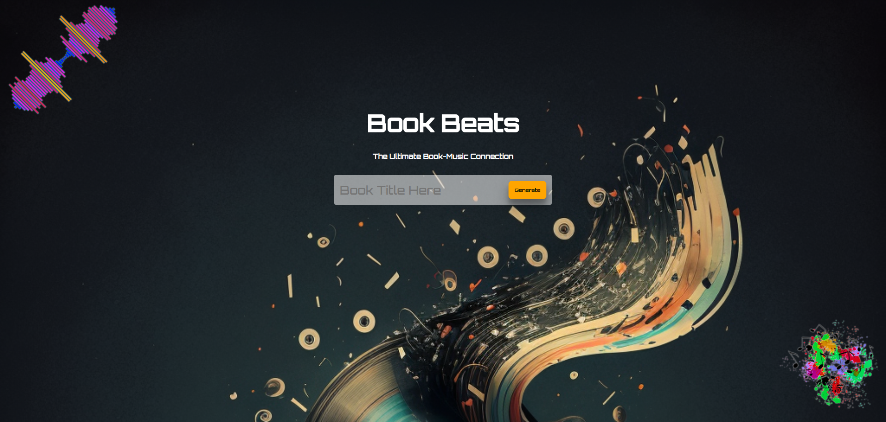

<!--
*** To avoid retyping too much info. Do a search and replace for the following:
*** github_username, repo, twitter_handle, email
-->

<!-- PROJECT SHIELDS -->
<!--
*** I'm using markdown "reference style" links for readability.
*** Reference links are enclosed in brackets [ ] instead of parentheses ( ).
*** See the bottom of this document for the declaration of the reference variables
*** for contributors-url, forks-url, etc. This is an optional, concise syntax you may use.
*** https://www.markdownguide.org/basic-syntax/#reference-style-links
-->

[![Contributors][contributors-shield]][contributors-url]
[![Forks][forks-shield]][forks-url]
[![Stargazers][stars-shield]][stars-url]
[![Issues][issues-shield]][issues-url]
[![MIT License][license-shield]][license-url]
[![LinkedIn][linkedin-shield]][linkedin-url]

<!-- PROJECT LOGO -->
<br />
<p align="center">
  <a href="https://github.com/mikeg1440/Book-Beats">
    
  </a>

  <h3 align="center">Book Beats</h3>

  <p align="center">
    Take a book your reading and get a AI generated a sound track to listen to while reading.
    <br />
    <a href="https://github.com/mikeg1440/Book-Beats"><strong>Explore the docs »</strong></a>
    <br />
    <br />
    <a href="https://github.com/mikeg1440/Book-Beats">View Demo</a>
    ·
    <a href="https://github.com/mikeg1440/Book-Beats/issues">Report Bug</a>
    ·
    <a href="https://github.com/mikeg1440/Book-Beats/issues">Request Feature</a>
  </p>
</p>

<!-- TABLE OF CONTENTS -->

## Table of Contents

- [Table of Contents](#table-of-contents)
- [About The Project](#about-the-project)
  - [Built With](#built-with)
- [Getting Started](#getting-started)
  - [Prerequisites](#prerequisites)
  - [Installation](#installation)
- [Todo](#todo)
  - [Ideas](#ideas)
- [Roadmap](#roadmap)
- [Contributing](#contributing)
- [License](#license)
- [Contact](#contact)
- [Acknowledgements](#acknowledgements)

<!-- ABOUT THE PROJECT -->

## About The Project

[![Book Beats Screen Shot][product-screenshot]](https://github.com/mikeg1440/Book-Beats)

Book Beats is designed to take the title of the book your currently reading and suggest 10 songs that would match the tone and style of the book well. After entering a book title the first song in the playlist will start playing and window with any video to associated with the song will start playing. The user has the option to pause, skip or change the song at any time using the playlist button on the page.

** NOTE ** Backend needs to be setup with correct API keys to work properly.

### Built With

- [React.js](https://react.dev)
- [Node.js](https://nodejs.org)
  - [google-search-results-nodejs](https://github.com/serpapi/google-search-results-nodejs)
- [OpenAI](https://openai.com)
- [Next.js](https://nextjs.org)

<!-- GETTING STARTED -->

## Getting Started

To get a local copy up and running follow these simple steps, you will need API keys from OpenAI and Googles SerpAPI for the app to function properly. The back end for this has been integrated into this single repo for simplicity and uses Next.js to run API endpoints.

### Prerequisites

These are the steps to follow to get the started

- npm

```sh
npm install npm@latest -g
```

Need to create a `.dotenv` file with the following API keys

```
OPENAI_API_KEY=YOUR_KEY
SERP_API_KEY=YOUR_KEY

```

### Installation

1. Clone the repo

```sh
git clone https://github.com/mikeg1440/Book-Beats.git
```

2. Install packages with NPM or `yarn`

```sh
npm install
```

3. Start dev environment

```
next dev
```

4. Set dev or production API, look at line 50 in `index.js` and set it to either `prodApi` or `devApi`

## Todo

- [x] Replace await with updated `.then()` use
- [x] Add mock endpoints with saved data so we don't use up free requests for API keys
- [x] Display video playlist incase first video isn't what user wanted
  - [x] Implement a overlay that toggles with a button
  - [x] Load song names
  - [x] Add click functionality to change video
  - [x] Change song data to pass a object instead of just song name
  - [x] Add thumbnail image and more formatting to emphasize song name
  - [x] Save song object instead of just name
- [ ] Display playlist that AI suggested from book title
  - [ ] Add song click functionality that changes song from playlist
- [ ] Change test api calls back to openai api calls
- [x] Add loading overlay

### Ideas

- [x] Display the full list of songs returned by the AI
- [ ] Give users ability to select from the the top 3 youtube videos in case the first one isn't good
  - [ ] Autoplay the next song in the list when a song finishes
  - [x] Display playlist for user to see
  - [x] Allow user to select from playlist

<!-- ROADMAP -->

## Roadmap

See the [open issues](https://github.com/mikeg1440/Book-Beats/issues) for a list of proposed features (and known issues).

<!-- CONTRIBUTING -->

## Contributing

Contributions are what make the open source community such an amazing place to be learn, inspire, and create. Any contributions you make are **greatly appreciated**.

1. Fork the Project
2. Create your Feature Branch (`git checkout -b feature/AmazingFeature`)
3. Commit your Changes (`git commit -m 'Add some AmazingFeature'`)
4. Push to the Branch (`git push origin feature/AmazingFeature`)
5. Open a Pull Request

<!-- LICENSE -->

## License

Distributed under the MIT License. See `LICENSE` for more information.

<!-- CONTACT -->

## Contact

Mike G - [@mylogicbytes1](https://twitter.com/mylogicbytes1)

Project Link: [https://github.com/mikeg1440/Book-Beats](https://github.com/mikeg1440/Book-Beats)

<!-- ACKNOWLEDGEMENTS -->

## Acknowledgements

- []()
- []()
- []()

<!-- MARKDOWN LINKS & IMAGES -->
<!-- https://www.markdownguide.org/basic-syntax/#reference-style-links -->

[contributors-shield]: https://img.shields.io/github/contributors/mikeg1440/Best-README-Template.svg?style=flat-square
[contributors-url]: https://github.com/mikeg1440/Book-Beats/graphs/contributors
[forks-shield]: https://img.shields.io/github/forks/mikeg1440/Best-README-Template.svg?style=flat-square
[forks-url]: https://github.com/mikeg1440/Book-Beats/network/members
[stars-shield]: https://img.shields.io/github/stars/mikeg1440/Best-README-Template.svg?style=flat-square
[stars-url]: https://github.com/mikeg1440/Book-Beats/stargazers
[issues-shield]: https://img.shields.io/github/issues/mikeg1440/Best-README-Template.svg?style=flat-square
[issues-url]: https://github.com/mikeg1440/Book-Beats/issues
[license-shield]: https://img.shields.io/github/license/mikeg1440/Best-README-Template.svg?style=flat-square
[license-url]: https://github.com/mikeg1440/Book-Beats/blob/master/LICENSE.txt
[linkedin-shield]: https://img.shields.io/badge/-LinkedIn-black.svg?style=flat-square&logo=linkedin&colorB=555
[linkedin-url]: https://linkedin.com/in/michaelgaudreau
[product-screenshot]: screenshots/SearchResult1.png
